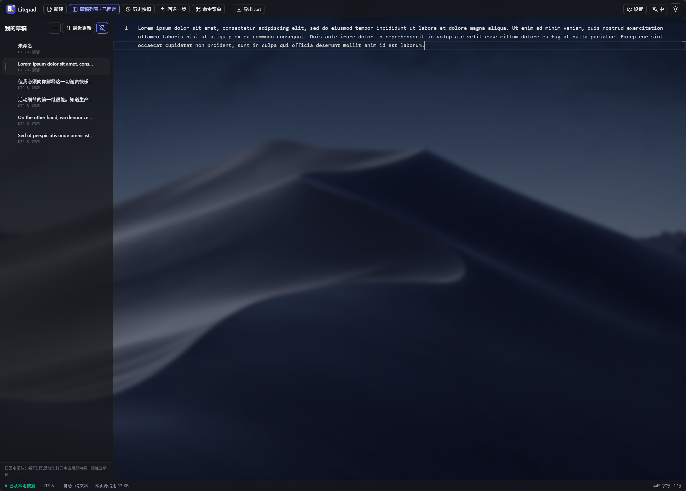

<p align="center">
  
</p>

<h1 align="center">Litepad</h1>

<p align="center">
  <b>打开标签页就能记东西的临时文本编辑器</b><br />
  纯本地 · 零后端 · 自动保存 · 不弹保存对话框
</p>

<p align="center">
  <code>Vue 3</code>&nbsp; <code>TypeScript</code>&nbsp; <code>Vite</code>&nbsp; <code>Tailwind CSS v4</code>&nbsp;
  <code>Monaco Editor</code>
</p>

<p align="center">
  
</p>

<p align="center">
  <sub>深色主题 + 背景图片 + 左侧常驻草稿列表（草稿列表可在浮层抽屉与固定面板间切换）</sub>
</p>

---

每个草稿都只存在你自己浏览器的 `localStorage` 里：无账号、无网络依赖，数据不经过任何服务器。
按 `Ctrl+S` 也不会弹保存框，只会提示「无需手动保存：内容已自动保存」。

## 特性

- **VS Code 同款编辑器内核**：Monaco Editor —— 语法着色、多光标、查找替换、每篇草稿独立撤销栈；
- **自动保存**：停止输入 400ms 落盘，切换标签/关闭页面/刷新都会强制落盘，断电重启也不丢；
- **每个标签一篇草稿**：草稿列表可在浮层抽屉与左侧全高常驻面板之间切换（状态持久化），支持拖动排序与「最近更新」一键重排；
- **误删不怕**：`doc` / `doc.bak` 双键轮换 + 每 20 秒一份历史快照（每篇最多 40 份），可「回退一步」或从任意快照恢复；
- **代码语法着色**：91 种语言（以 Monaco 注册表为准），按草稿独立记忆，默认按内容自动检测；
- **命令面板**：`Ctrl/⌘+Shift+P` 或 `F1`，34 条命令，覆盖行操作、大小写与命名、编码与数据、文本、导航；
- **文本编码**：每篇草稿可单独指定，UTF-8/UTF-16 全家族 + GBK/GB18030/Big5/Shift_JIS/EUC-KR 等，决定 `.txt` 导入导出的字节；
- **中英双语界面**：默认跟随浏览器语言，工具栏可随时切换并持久化；
- **设置弹窗**（`Ctrl/⌘+,`）：主题、界面语言、背景图片（存 IndexedDB）、图片可见度、背景模糊度、编辑区底色，以及备份导出/导入与存储占用；
- **「关于 Litepad」面板**：模仿新版 macOS 关于页面，可查看版本/构建号与运行信息，一键复制诊断信息；
- **数据自主**：一键导出全部草稿为 JSON（可再合并导入），单篇可按指定编码导出 `.txt`；
- 页内 LOGO 与浏览器标签页图标（favicon）共用同一份 SVG 源码。

## 快速开始

> 不想本地跑？线上版本：<https://dynesshely.github.io/litepad/> ——
> 由 GitHub Actions 从 `main` 构建发布；它和本地是**不同的浏览器源**，数据各自独立。

```bash
npm install
npm run dev        # 开发模式 http://0.0.0.0:18080
npm run build      # 构建到 dist/
npm run preview    # 预览构建产物
npm run typecheck  # vue-tsc 类型检查
```

> 请通过 **http** 访问（dev / preview / 任意静态服务器），不要用 `file://` ——
> 不同浏览器对 `file://` 页面的 `localStorage` 支持不一致（页面会自检并给出提示）。
> 反向代理到自定义域名时，记得把域名加进 `vite.config.ts` 的 `server.allowedHosts`。

## Docker 部署

镜像为多阶段构建：`node:22-alpine` 里 `npm ci && npm run build`，再把 `dist/` 交给
`caddy:2-alpine` 静态托管（配置见 `Caddyfile`），容器内监听 **28080**（= 本地 dev 端口 18080 + 10000）。

```bash
# 构建并运行
docker build -t dynecloud-litepad:latest .
docker run -d --name dynecloud-litepad -p 28080:28080 --restart unless-stopped dynecloud-litepad:latest
# 或
docker compose up -d --build
```

容器里没有 `.git`，所以构建号与仓库地址由构建参数传入（不传则构建号回退 `dev`、顶栏/底栏的
GitHub 入口自动隐藏）：

```bash
docker build --build-arg APP_BUILD=$(git rev-parse --short HEAD) \
             --build-arg APP_REPO_URL=https://github.com/Dynesshely/litepad \
             -t dynecloud-litepad:latest .
```

推送与部署：`image.build.ps1` / `image.push.ps1`（与同组织的其它项目一致），
镜像推到 `registry.services.nimatattic.net/dynecloud/dynecloud-litepad:latest`。

## 使用

### 草稿与自动保存

- 工具栏最左是新建；草稿列表可在**浮层抽屉**与**左侧全高常驻面板**之间切换（固定状态会记住）；
- 列表默认按手动顺序排列，按住条目拖动即可调整，位移超过 4px 才算拖动（所以点一下切换草稿不受影响）；
- 每篇草稿的历史快照可随时打开回退；`Ctrl+Z` 撤销、`Ctrl+S` 不会弹保存框（只会提示「已自动保存」）。

### 命令面板

`Ctrl/⌘+Shift+P` 或 `F1` 唤起（编辑器聚焦与否都可以），工具栏也有入口；支持模糊搜索（标题 / id / 关键词）、
`↑↓` 选择、`Enter` 执行、`Esc` 关闭。

| 分组 | 命令 |
| --- | --- |
| 行操作 | 多行转单行（可指定连接符）、单行转多行（**选区即分隔符**）、整篇按分隔符拆分、行排序（升序/降序，数字感知）、行去重、反转行序、删除空行、去除首尾空白、删除行尾空白、每行加行号、每行加双引号、切换行注释 |
| 大小写与命名 | 大写、小写、大小写互换、kebab-case、snake_case、camelCase |
| 编码与数据 | Base64 编码/解码、URL 编码/解码、JSON 美化/压缩、JSON 字符串转义/反转义 |
| 文本 | 反转字符顺序、每行加 Markdown 引用、折叠连续空格 |
| 导航与信息 | 文本统计（选区或全文）、跳转到行、切换代码语言、打开设置 |

**作用范围**：有选区就作用于选区；行类命令（排序、去重、删除空行等）在有选区时作用于选区覆盖的整行，
**没有选区则作用于整篇**（与 VSCode 一致）。所有行类变换都会先归一化 `\r\n` / 孤立 `\r`，并按原文档的换行风格回写。
替换走编辑器自身的编辑操作，因此**一条命令只占一步撤销**。

### 代码着色与语言

底栏显示当前草稿的语言，**点击即可切换**（与文本编码并排，都是「每篇草稿各自记住」的属性）：

- 菜单顶部是「自动检测 / 纯文本」，其余按「常用 / 全部」分组，带搜索框；
- **自动检测**（默认）按正文内容判断语言，信号不足时**宁可不着色**也不会乱猜，回退成纯文本；
- 语言模式按草稿保存，切换草稿、刷新页面都会保留；
- 只做着色，不做补全/诊断那套 IDE 能力。

### 文本编码

编码只在**字节边界**上有意义：导出 `.txt` 时把字符串编成字节，导入时把字节解回字符串 ——
编辑器内部与存储中始终是文本，**切换编码不会改动正文**。

| 分组 | 编码 | 说明 |
| --- | --- | --- |
| Unicode | UTF-8、UTF-8 BOM、UTF-16 LE/BE（含 BOM 变体） | 原生编码，无损 |
| 中文 | GBK、GB18030、Big5 | GB18030 四字节生僻字不支持编码 |
| 日文 / 韩文 / 西欧 | Shift_JIS、EUC-KR、Windows-1252、ISO-8859-1 | 按需生成映射表 |

编码**按草稿独立保存**，状态栏点击即可切换。导入 `.txt` 时优先识别 BOM；目标编码表示不了的字符会写成 `?`，
并在状态栏提示数量。

### 界面语言

内置 **简体中文 / English**，入口在工具栏主题按钮左侧，切换后立即生效并持久化；首次访问时跟随浏览器语言。

### 设置与外观

顶栏右侧「设置」按钮（或 `Ctrl/⌘+,`、命令面板「打开设置」）打开设置弹窗，
版式为**上部整宽搜索顶栏 + 下部左侧分页 / 右侧内容**：

- 搜索框索引全部设置项，命中后回车或点击即切页、把对应设置行滚动进可视区并短暂高亮；
- **外观**：主题、语言、背景图片、图片可见度、背景模糊度、编辑区保留底色；
- **数据**：导入备份、备份全部、存储占用、草稿数量。

背景图片以 Blob 存在 **IndexedDB**（只把会话内的 `URL.createObjectURL` 放在内存里），
不会上传到任何地方；仅接受图片类型、上限 8MB。图片可见度越低遮挡越强、正文越清晰，
另有 0–40px 模糊度；壁纸花的时候可以打开「编辑区保留底色」，让正文压在照片上也读得清。

### 关于面板与版本

点工具栏品牌区（Logo + 文字）打开「关于 Litepad」面板：顶部为 64px 大图标（与 favicon 同源）与应用名，
下接 `版本 x.y.z · 构建 <git 短哈希>` 与规格行（内核/框架/存储/占用/草稿数/当前草稿/语言/主题/快照策略），
可 `Esc`、点遮罩或按钮退出，也可一键复制诊断信息（版本、环境、占用等）便于排查问题。

### 图标

界面图标统一使用 **[Lucide](https://lucide.dev)**（`@lucide/vue`，ISC 许可），不使用 emoji ——
emoji 在不同系统下字形与尺寸不一致，也无法跟随深浅色主题变色。图标按需引入、单色图标继承 `currentColor`，
并一律 `aria-hidden`，可访问名称由按钮的 `title` / `aria-label` 提供。

## 数据与存储

数据全部在浏览器本地，键前缀为 `dsh.scratch.v1.*`：

| 键 | 内容 |
| --- | --- |
| `dsh.scratch.v1.index` | 草稿元数据（标题、时间、编码、语言、排序位置） |
| `dsh.scratch.v1.doc.<id>` | 草稿正文 |
| `dsh.scratch.v1.doc.<id>.bak` | 上一次保存的备份（用于「回退一步」） |
| `dsh.scratch.v1.doc.<id>.hist` | 历史快照 |
| `dsh.scratch.v1.ui` | 主题、界面语言、列表固定状态、壁纸可见度/模糊度等偏好 |

- 存储不可用时会自动降级：`localStorage` → `sessionStorage` → 内存，并给出醒目横幅提示；
- 占用写满（约 5MB）时同样降级并提示，状态栏实时显示本页占用；
- **数据是按浏览器源（origin）隔离的**：换端口、换域名或从 `file://` 打开都看不到原来的草稿 ——
  需要迁移时请用「备份全部」导出 JSON，在新地址「导入备份」。

## 开发

开发环境、目录结构、内部约定、测试与已知问题见 [`docs/DEVELOPMENT.md`](./docs/DEVELOPMENT.md)；
实现层的取舍与踩坑记录见 [`docs/IMPLEMENTATION.md`](./docs/IMPLEMENTATION.md)。

## 第三方组件

| 组件 | 用途 | 许可 |
| --- | --- | --- |
| [Vue 3](https://vuejs.org) | 视图层 | MIT |
| [Vite](https://vite.dev) + [Rolldown](https://rolldown.rs) | 构建与开发服务器 | MIT |
| [Tailwind CSS v4](https://tailwindcss.com) | 样式 | MIT |
| [Monaco Editor](https://microsoft.github.io/monaco-editor/) | 编辑器内核（VS Code 同款） | MIT |
| [Lucide](https://lucide.dev)（`@lucide/vue`） | 图标 | ISC |

## 许可

本项目以 **MIT 许可证**发布，见 [`LICENSE`](./LICENSE) —— 你可以自由使用、修改、分发，
包括商用与闭源再分发，只需保留版权声明与许可声明。

`LICENSE` 是 [SPDX 官方文本库](https://github.com/spdx/license-list-data) 中 `text/MIT.txt` 的原文
（仅填入署名行，未作改写）。
